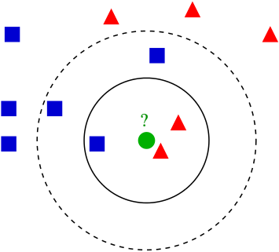

[![Contributors][contributors-shield]][contributors-url]
[![Forks][forks-shield]][forks-url]
[![Stargazers][stars-shield]][stars-url]
[![Issues][issues-shield]][issues-url]
[![GNU GPL V.30 License][license-shield]][license-url]
[![LinkedIn][linkedin-shield]][linkedin-url]


<br />
<p align="center">
  <a href="https://github.com/GPurgatorio/md-parallel-and-distributed-systems">
    
  </a>

  <h3 align="center">Parallel and Distributed Systems: paradigms and models</h3>

  <p align="center">
    Repository for my project submission: two C++ KNN implementations, one using the standard library and one using FastFlow. There are also two other implementations that weren't submitted (see older_versions) and were made for fun, one exploiting OMP pragmas and one building an explicit Farm skeleton through FastFlow lower level's building blocks.
    <br />
    <a href="https://github.com/GPurgatorio/md-parallel-and-distributed-systems/issues">Report Bug</a>
  </p>
</p>


<details open="open">
  <summary><h2 style="display: inline-block">Table of Contents</h2></summary>
  <ol>
    <li><a href="#about-the-project">About The Project</a></li>
    <li><a href="#getting-started">Getting Started</a></li>
    <li><a href="#usage">Usage</a></li>
    <li><a href="#license">License</a></li>
    <li><a href="#contact">Contact</a></li>
  </ol>
</details>


## About The Project

Repository for the _Parallel and Distributed Systems: Paradigms and Models_'s course, Pisa's university (2020-2021).

The project has been tested on an Ubuntu 20.04 VM and on the remote machine provided during the course (Xeon PHI, 64 cores quad-hyperthreading).

_To get more in-depth, please refer to the [Report](https://github.com/GPurgatorio/md-parallel-and-distributed-systems/blob/main/report.pdf)_.


### Built With

* [C++](https://isocpp.org/)
* [FastFlow](https://github.com/fastflow/fastflow)

## Getting Started

To get a local copy up and running follow these simple steps.


### Installation

1. Follow the instructions to install FastFlow (and C++ is obviously needed)
2. Clone the md-parallel-and-distributed-systems
   ```sh
   git clone https://github.com/GPurgatorio/md-parallel-and-distributed-systems.git
   ```
3. Use the makefile (optional, a specific version by explicitly typing it)
   ```sh
   make
   ```

## Usage

To test the project, I've already provided 3 input files of different sizes.
_input.csv_ has 10K random points, _input_medium.csv_ has 50K random points and finally _input_long.csv_ has 100K random points. These were all created through a proper invocation of _utils/create_input_file.cpp_.

Then to run a single 20-NN execution on 10K points with 6 workers (e.g. the STL version):
   ```sh
   ./knn_stl input.csv 20 6
   ```
 
It's also possible to smooth outliers by automatically averaging many runs together through the additional script provided, by issuing the following command (e.g. repeat 8 times):
   ```sh
   ./average_time.sh knn_stl input.csv 20 6 8
   ```


## License

Distributed under the GNU General Public License v3.0 License. See `LICENSE` for more information.


## Contact

[Giulio Purgatorio](https://gpurgatorio.github.io/)


[contributors-shield]: https://img.shields.io/github/contributors/GPurgatorio/md-parallel-and-distributed-systems.svg?style=for-the-badge
[contributors-url]: https://github.com/GPurgatorio/md-parallel-and-distributed-systems/graphs/contributors
[forks-shield]: https://img.shields.io/github/forks/GPurgatorio/md-parallel-and-distributed-systems.svg?style=for-the-badge
[forks-url]: https://github.com/GPurgatorio/md-parallel-and-distributed-systems/network/members
[stars-shield]: https://img.shields.io/github/stars/GPurgatorio/md-parallel-and-distributed-systems.svg?style=for-the-badge
[stars-url]: https://github.com/GPurgatorio/md-parallel-and-distributed-systems/stargazers
[issues-shield]: https://img.shields.io/github/issues/GPurgatorio/md-parallel-and-distributed-systems.svg?style=for-the-badge
[issues-url]: https://github.com/GPurgatorio/md-parallel-and-distributed-systems/issues
[license-shield]: https://img.shields.io/github/license/GPurgatorio/md-parallel-and-distributed-systems.svg?style=for-the-badge
[license-url]: https://github.com/GPurgatorio/md-parallel-and-distributed-systems/blob/master/LICENSE.txt
[linkedin-shield]: https://img.shields.io/badge/-LinkedIn-black.svg?style=for-the-badge&logo=linkedin&colorB=555
[linkedin-url]: https://linkedin.com/in/GPurgatorio
